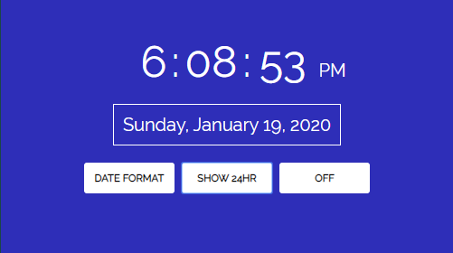

# Digital Clock

_A simple digital clock that displays in 12 and 24 hour format_

## Summary
A digital clock built with vanilla JS to practice DOM manipulation.  

&nbsp;&nbsp;
&nbsp;&nbsp;
&nbsp;&nbsp;